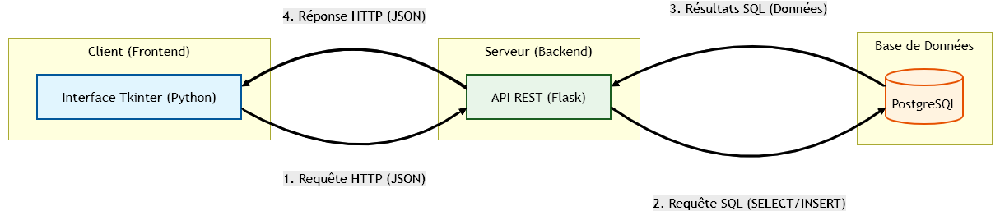
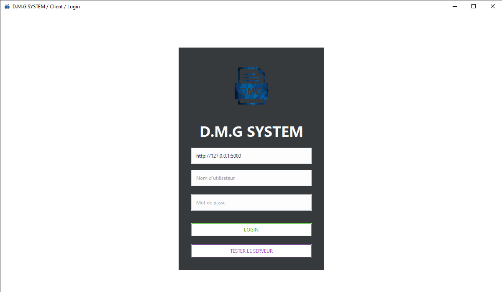
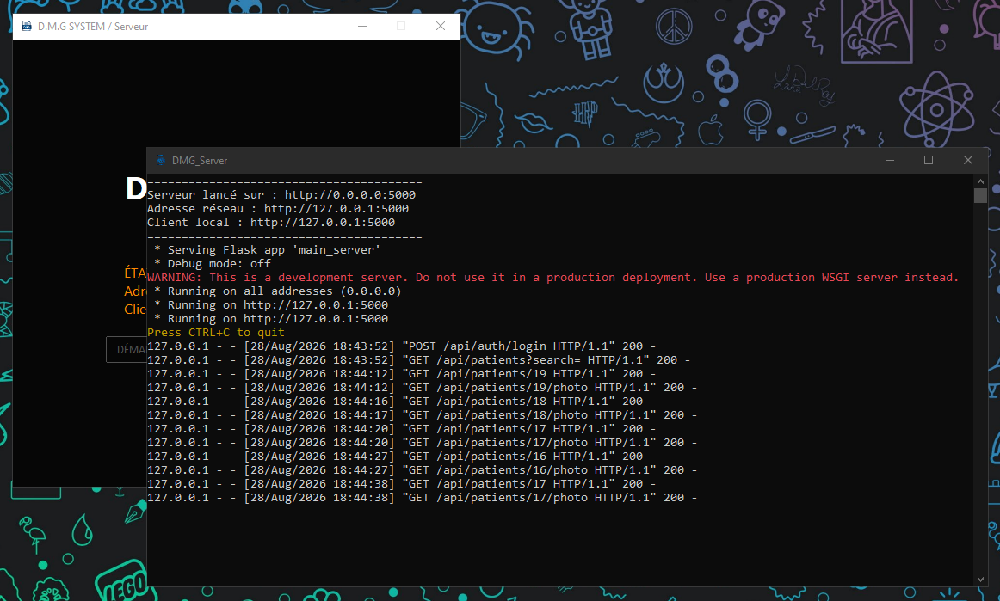
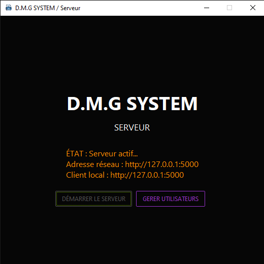
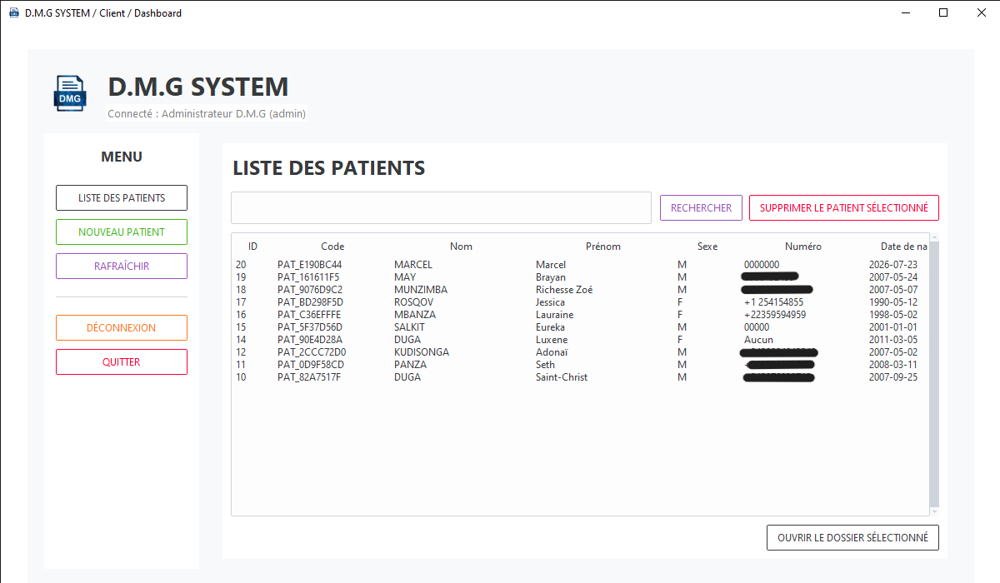
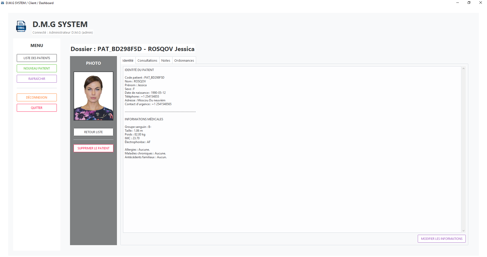
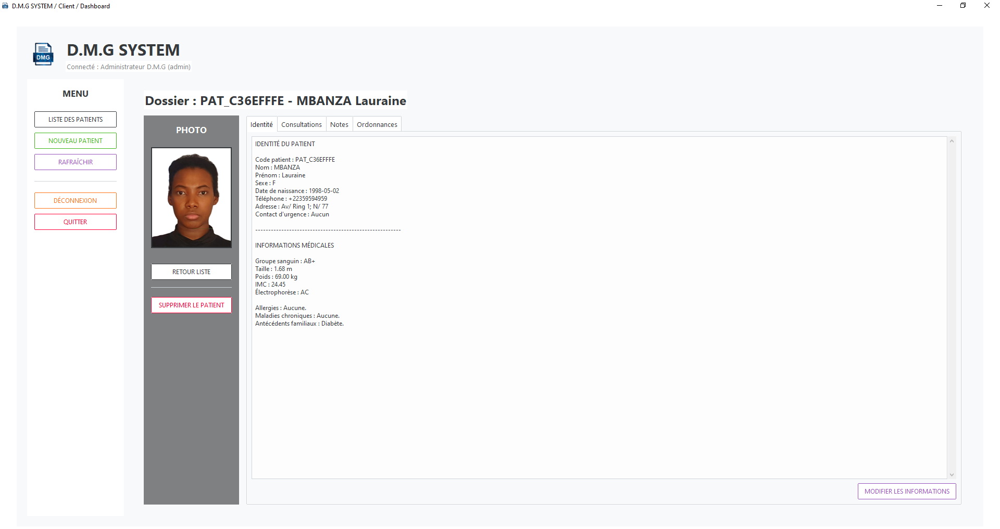
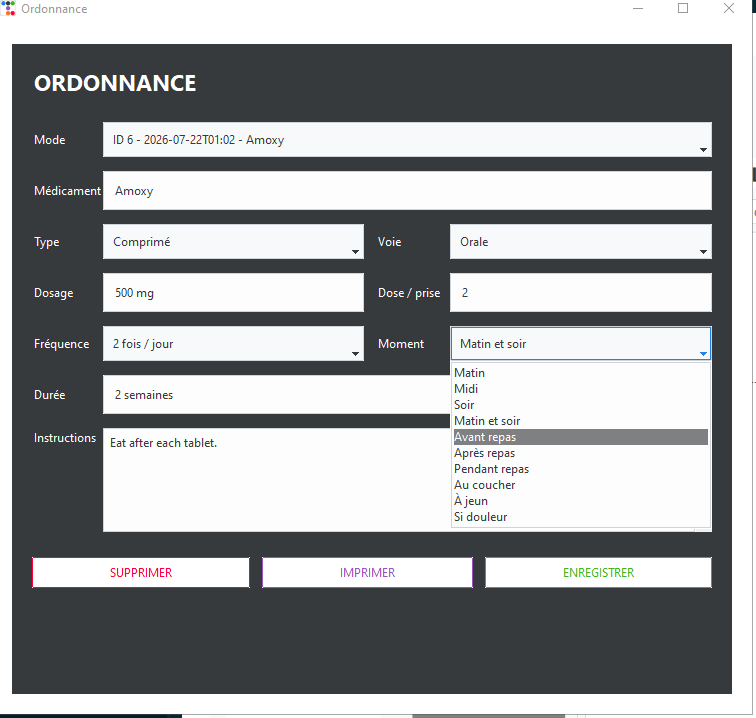
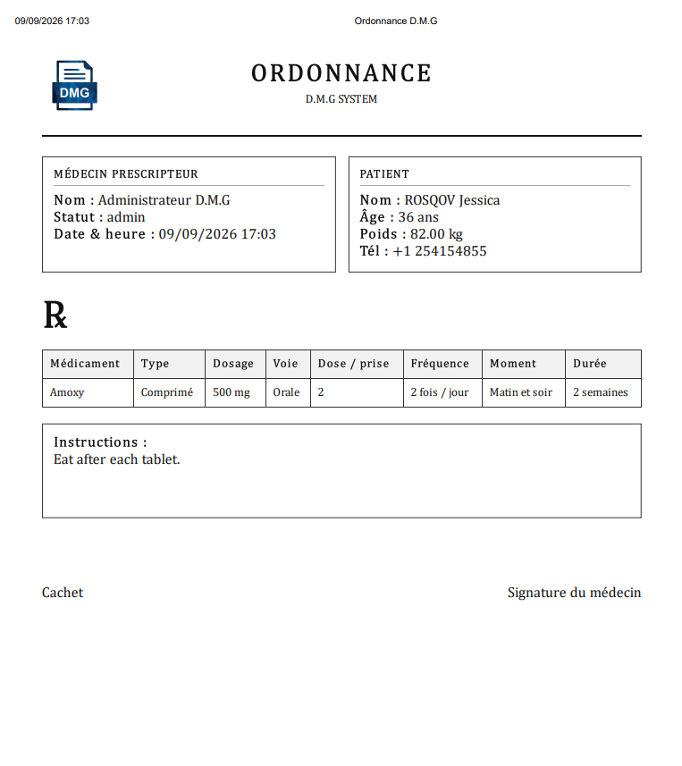

# D.M.G SYSTEM - Medical Patient Management System
D.M.G SYSTEM is a desktop client-server application designed for healthcare facilities. It allows medical staff to manage
patient records, consultations, notes, printable prescriptions, and user roles over a local network.

## Project Type
Desktop application + local server + PostgreSQL database.

## My Role
Full-stack developer.

## Main Features

- Secure login system
- Admin, doctor and nurse roles
- Patient registration with photo support
- Patient medical record
- Consultations management
- Medical notes
- Printable prescriptions
- Local network deployment for multiple PCs
- PostgreSQL database
- Python EXE compilation with PyInstaller

## Technologies

- **Python** 
- **ttkbootstrap / Tkinter** (Frontend GUI)
- **Flask API** (Backend Server)
- **PostgreSQL** (Database)
- **HTML/CSS** (For printable prescriptions)
- **PyInstaller** (Executable compilation)

## Architecture & Visuals

Client PCs connect to a Flask server over the local network. The Flask server communicates with PostgreSQL and returns structured JSON data to the desktop clients.

Architecture, database, and workflow diagrams are available in the `docs/` directory:
- Network Architecture Diagram



- [Database Schema (ERD)](./docs/database_schema.png)
- [User Workflow](./docs/user_flow.png)

## Screenshots
A full visual overview of the application is available in the [`screenshots/`](./screenshots/) folder:

- Login & Role Access



- Server Control Panel




- Dashboard & Patient List



- Patient Record & Vitals




- Prescription Form & Printing




## Code Samples

To review code architecture and style, extracts are available in the [`code_samples/`](./code_samples/) folder:
- `api_client_sample.py`

    <details>
    <summary><b>🔍 Click here</b></summary>

    ```python
    # ================= API CLIENT =================
    class ApiClient:
        """Centralise toutes les requêtes HTTP avec le serveur."""

        def __init__(self, server_url):
            server_url = (server_url or "").strip()

            if server_url and not server_url.startswith(("http://", "https://")):
                server_url = f"http://{server_url}"

            self.server_url = server_url.rstrip("/")
            self.token = None
            self.user = None

        # ================= REQUEST CORE =================
        def request(self, method, endpoint, **kwargs):
            """
            Envoie une requête au serveur et retourne data.
            """
            url = f"{self.server_url}{endpoint}"

            try:
                response = requests.request(
                    method=method,
                    url=url,
                    headers=self.headers(),
                    timeout=12,
                    **kwargs,
                )
            except requests.exceptions.ConnectionError as exc:
                raise RuntimeError(
                    "Impossible de joindre le serveur. Vérifiez que le serveur est lancé, "
                    "que l'IP est correcte et que le PC est sur le même réseau que le serveur."
                ) from exc
            except requests.exceptions.Timeout as exc:
                raise RuntimeError("Le serveur met trop de temps à répondre.") from exc

            try:
                payload = response.json()
            except ValueError as exc:

                raise RuntimeError(
                    f"Réponse serveur invalide. Code HTTP : {response.status_code}. "
                    "Regarde la console du serveur pour l'erreur exacte."
                ) from exc

            if not response.ok or not payload.get("success"):
                raise RuntimeError(payload.get("error", "Erreur, serveur inconnue."))

            return payload.get("data", {})
    ```
    </details>


- `dashboard_ui_sample.py`

    <details>
    <summary><b>🔍 Click here</b></summary>

    ```python
    from tkinter import messagebox, filedialog
    from tkinter.scrolledtext import ScrolledText

    import ttkbootstrap as tb
    from ttkbootstrap.constants import *

    class DashboardUI:
        """Écran principal après connexion."""

        def __init__(self, window, api, user, on_logout=None):
            # ================= WINDOW =================
            self.window = window
            self.api = api
            self.user = user
            self.on_logout = on_logout

            # ================= STATE =================
            self.selected_patient_id = None
            self.patient_photo_image = None
            self.current_patient = {}
            self.current_consultations = []
            self.current_notes = []
            self.current_ordonnances = []

            # ================= STYLE =================
            apply_styles()

            # ================= BUILD =================
            self.build_ui()
            self.refresh_patients(show_errors=False)

        # ================= MAIN UI =================
        def build_ui(self):
            clear_window(self.window)

            # ================= MAIN FRAME =================
            main_frame = tb.Frame(self.window)
            main_frame.pack(fill=BOTH, expand=True)
            main_frame.columnconfigure(0, weight=1)
            main_frame.rowconfigure(0, weight=1)

            # ================= CARD =================

            card = tb.Frame(main_frame, padding=20, bootstyle=LIGHT)
            card.grid(row=0, column=0, sticky=NSEW, padx=32, pady=28)
            card.columnconfigure(1, weight=1)
            card.rowconfigure(1, weight=1)
    ```
    </details>


- `patients_api_sample.py`
    <details>
    <summary><b>🔍 Click here</b></summary>

    ```python
    # ================= PATIENTS =================
    def list_patients(self, search=""):
        """Récupère la liste des patients."""
        data = self.request("GET", "/api/patients", params={"search": search})
        return data.get("patients", [])

    def create_patient(self, patient_data):
        """Envoie le formulaire complet d'un patient au serveur."""
        return self.request("POST", "/api/patients", json=patient_data)

    def get_patient(self, patient_id):
        """Récupère le dossier complet d'un patient."""
        return self.request("GET", f"/api/patients/{patient_id}")

    def update_patient(self, patient_id, data):
        """Modifie les informations d'un patient."""
        return self.request("PUT", f"/api/patients/{patient_id}", json=data)

    def delete_patient(self, patient_id):
        """Supprime un patient."""
        return self.request("DELETE", f"/api/patients/{patient_id}")

    def get_patient_photo(self, patient_id):
        """Télécharge la photo du patient. Retourne None si aucune photo."""
        url = f"{self.server_url}/api/patients/{patient_id}/photo"

        try:
            response = requests.get(url, headers=self.headers(), timeout=12)
        except requests.exceptions.ConnectionError as exc:
            raise RuntimeError("Impossible de charger la photo du patient.") from exc
        except requests.exceptions.Timeout as exc:
            raise RuntimeError("Le serveur met trop de temps à envoyer la photo.") from exc

        if response.status_code == 404:
            return None

        if not response.ok:
            raise RuntimeError("Erreur lors du chargement de la photo.")

        return response.content
    ```
    </details>


## Demo Video

- [Watch 2-Minute Demo Video](https://your-video-link-here.com) *(Link to Loom, YouTube, or Google Drive)*

## Documentation

[Documentation](./docs/Docu_DMG_SYSTEM.pdf)

## Notice & Rights

⚠️ **Showcase Repository**

Copyright © 2026 Saint-Christ Duga aka GHOST172HD. All rights reserved.

This public repository is for portfolio and demonstration purposes only.

The full source code and proprietary assets remain private to protect intellectual property and commercial integrity. See [NOTICE.md](./NOTICE.md) for complete usage terms.